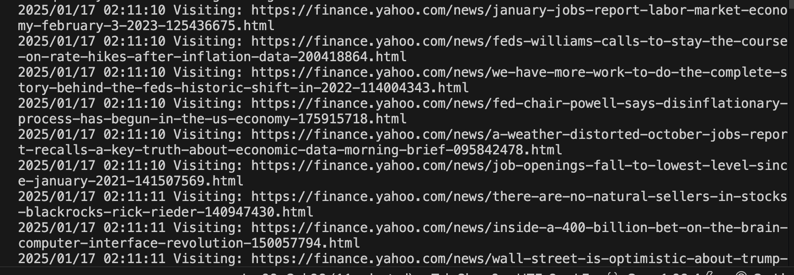

# GoFinance Intelligence Hub

A high-performance Yahoo Finance web scraper built in Go, multi-threaded data processing, wrapped in rate-limited REST API, hook in several LLM models for summarizing news, analyze stocks and evaluate market's sectors.

# Set up web-scraper server

cd yahoo_finance_scrapper
go run main.go
go mod download

Server now accepting request at localhost:8080

# Scraping for news demanded from request curl "http://localhost:8080/api/news"

# Scrape results returned by scraper

